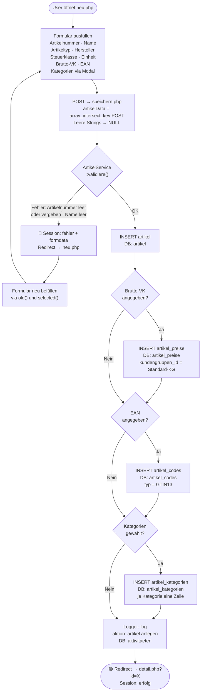
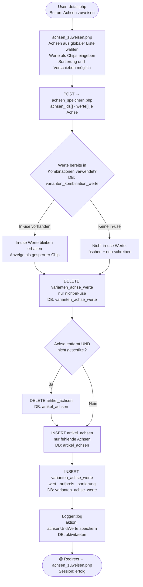
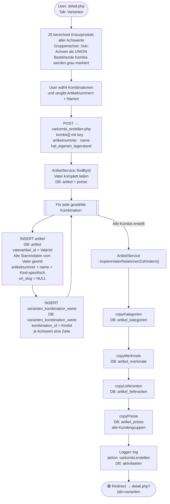

# Artikel-Modul: Workflows

> **Zielgruppe:** Entwickler  
> **Enthält:** Seitenpfade, Validierungen, DB-Tabellen, Seiteneffekte, Fehlerpfade  
> **Handbuch (Frontend-only):** siehe `../handbuch/artikel_handbuch.md`

---

## Legende

| Symbol | Bedeutung |
|--------|-----------|
| Abgerundete Box | Start / Ende (Seite oder Redirect) |
| Rechteck | Verarbeitungsschritt (PHP, Service, Repository) |
| Raute | Entscheidung / Verzweigung |
| `DB:` | Betroffene Datenbanktabelle(n) |
| 🔴 | Fehler-/Abbruchpfad |
| 🟢 | Erfolgspfad |

---

## 1. Artikel anlegen (Standard)

**Seiten:** `artikel/neu.php` → `artikel/speichern.php` → `artikel/detail.php`  
**Service:** `ArtikelService::save()`  
**Repository:** `ArtikelRepository::insert()`, `insertPreis()`, `insertCode()`

### Validierungsregeln

| Feld | Regel |
|------|-------|
| `artikelnummer` | Pflichtfeld + UNIQUE (prüft DB, excludiert eigene ID bei Update) |
| `name` | Pflichtfeld |
| `steuerklasse_id` | Pflichtfeld (Dropdown, immer vorbelegt) |
| `artikeltyp` | Pflichtfeld (aus `artikel_typen` Tabelle, kein ENUM) |
| `einheit_id` | Pflichtfeld |

### Betroffene DB-Tabellen

| Tabelle | Operation | Bedingung |
|---------|-----------|-----------|
| `artikel` | INSERT | immer |
| `artikel_preise` | INSERT | wenn `brutto_vk` angegeben |
| `artikel_codes` | INSERT | wenn `ean_gtin13` angegeben |
| `artikel_kategorien` | INSERT (mehrere) | wenn Kategorien gewählt |
| `aktivitaeten` | INSERT | immer (Logger) |

---

## 2. Varianten erstellen (VarKombi — zweistufig)

Der Varianten-Workflow besteht aus zwei getrennten Aktionen:
- **Stufe 1:** Achsen + Werte zuweisen (definiert die Dimensionen z.B. Farbe, Stärke)
- **Stufe 2:** Aus den Achswerten Kombinationen generieren (erstellt die Kind-Artikel)

### Voraussetzungen

- Vater-Artikel existiert
- Mindestens eine globale Achse in `varianten_achsen` vorhanden

---

### Stufe 1: Achsen + Werte zuweisen

**Seiten:** `artikel/achsen_zuweisen.php` → `artikel/achsen_speichern.php`  
**Service:** `VariantenService::speichereAchsenUndWerte()`

---

### Stufe 2: VarKombi-Generator (Kind-Artikel erstellen)

**Seiten:** `artikel/detail.php` Tab Varianten → `artikel/varkombi_erstellen.php`  
**Service:** `VariantenService::erstelleKombinationen()` + `ArtikelService::kopiereVaterRelationenZuKindern()`

### Was Kinder vom Vater erben (beim Erstellen)

| Bereich | Felder |
|---------|--------|
| Stamm | `hersteller_id`, `steuerklasse_id`, `artikeltyp_id`, `einheit_id` |
| Beschreibungen | `kurzbeschreibung`, `beschreibung`, `technische_details`, `beschreibung_intern` |
| SEO | `meta_titel`, `meta_description` — `url_slug` = NULL |
| Logistik | `inhalt_menge`, `inhalt_einheit`, `gewicht_artikel`, `gewicht_versand`, `laenge`, `breite`, `hoehe` |
| Zoll | `herkunftsland`, `taric_code` |
| Grundpreis | `grundpreis_bezugsmenge`, `grundpreis_anzeigen` |
| Verhalten | `charge_pflicht`, `ueberverkauf_erlaubt`, `ist_auslaufartikel` |
| Relationen | Kategorien · Merkmale · Lieferanten · Preise alle KG |

### Was Kinder NICHT erben

| Feld | Grund |
|------|-------|
| `artikelnummer` | Kind hat eigene Nummer |
| `name` | Kind hat eigenen Variantennamen |
| `url_slug` | Würde Shop-Duplikat-URLs erzeugen |
| `aktiv` | Startet immer mit `aktiv = 1` |
| `zustand` | Startet mit `neu` |

### Betroffene DB-Tabellen (Stufe 2)

| Tabelle | Operation | Menge |
|---------|-----------|-------|
| `artikel` | INSERT | 1 je Kombination |
| `varianten_kombination_werte` | INSERT | 1 je Achswert je Kombination |
| `artikel_kategorien` | INSERT SELECT | Vater-Kategorien × Kind-Anzahl |
| `artikel_merkmale` | INSERT SELECT | Vater-Merkmale × Kind-Anzahl |
| `artikel_lieferanten` | INSERT SELECT | Vater-Lieferanten × Kind-Anzahl |
| `artikel_preise` | INSERT SELECT | Vater-Preiszeilen × Kind-Anzahl |
| `aktivitaeten` | INSERT | 1 (Logger) |
