# Artikel-Modul: Workflows

> **Zielgruppe:** Entwickler  
> **Enthält:** Seitenpfade, Validierungen, DB-Tabellen, Seiteneffekte, Fehlerpfade  
> **Handbuch (Frontend-only):** siehe `../handbuch/artikel_handbuch.md`

---

## Legende

| Symbol | Bedeutung |
|--------|-----------|
| Abgerundete Box | Start / Ende (Seite oder Redirect) |
| Rechteck | Verarbeitungsschritt (PHP, Service, Repository) |
| Raute | Entscheidung / Verzweigung |
| `DB:` | Betroffene Datenbanktabelle(n) |
| 🔴 | Fehler-/Abbruchpfad |
| 🟢 | Erfolgspfad |

---

## Inhaltsverzeichnis

1. [Artikel anlegen](#1-artikel-anlegen-standard)
2. [Artikel bearbeiten](#2-artikel-bearbeiten)
3. [Artikel kopieren](#3-artikel-kopieren)
4. [Artikel löschen und reaktivieren](#4-artikel-löschen-und-reaktivieren)
5. [Varianten erstellen — Stufe 1: Achsen zuweisen](#5-varianten-erstellen--stufe-1-achsen--werte-zuweisen)
6. [Varianten erstellen — Stufe 2: VarKombi-Generator](#6-varianten-erstellen--stufe-2-varkombi-generator)
7. [Kind-Artikel bearbeiten](#7-kind-artikel-bearbeiten)
8. [Kategorien zuweisen (Modal)](#8-kategorien-zuweisen-modal)
9. [Kategorie-Baum verwalten](#9-kategorie-baum-verwalten)
10. [Preis-Workflows](#10-preis-workflows)
11. [Status-Workflows (Auslauf / Aktiv)](#11-status-workflows)
12. [SEO-Daten speichern](#12-seo-daten-speichern)

---

## 1. Artikel anlegen (Standard)

**Seiten:** `artikel/neu.php` → `artikel/speichern.php` → `artikel/detail.php`  
**Service:** `ArtikelService::save()`

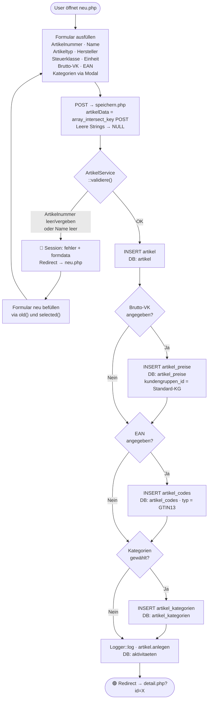

### Validierungsregeln

| Feld | Regel |
|------|-------|
| `artikelnummer` | Pflichtfeld + UNIQUE (DB-Check) |
| `name` | Pflichtfeld |
| `steuerklasse_id` | Pflichtfeld |
| `artikeltyp` | Pflichtfeld (aus `artikel_typen`, kein ENUM) |
| `einheit_id` | Pflichtfeld |

---

## 2. Artikel bearbeiten

**Seiten:** `artikel/bearbeiten.php` → `artikel/aktualisieren.php` → `artikel/detail.php`  
**Service:** `ArtikelService::update()` + `saveKategorien()`

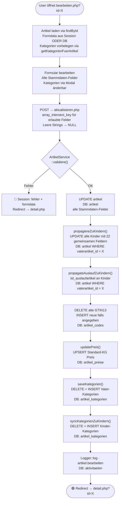

### Was bei Bearbeiten NICHT propagiert wird

| Feld | Grund |
|------|-------|
| `artikelnummer` | Kind hat eigene Nummer |
| `name` | Kind hat eigenen Variantennamen |
| `url_slug` | Kind hat eigenen Shop-Slug |
| `aktiv` | Eigene Logik via deactivate/reactivateKinder |
| `ist_auslaufartikel` | Eigene Logik via propagateAuslaufZuKindern |

---

## 3. Artikel kopieren

**Seiten:** `artikel/kopieren.php` → `artikel/kopieren_speichern.php` → `artikel/detail.php`  
**Service:** `ArtikelService::kopiere()`

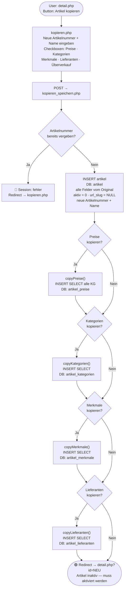

> **Hinweis:** Kopierter Artikel startet immer mit `aktiv = 0`. Varianten/Kinder werden nicht mitkopiert.

---

## 4. Artikel löschen und reaktivieren

**Seiten:** `artikel/delete.php` (GET) · Button in detail.php  
**Service:** `ArtikelService::delete()` / `aktivieren()`

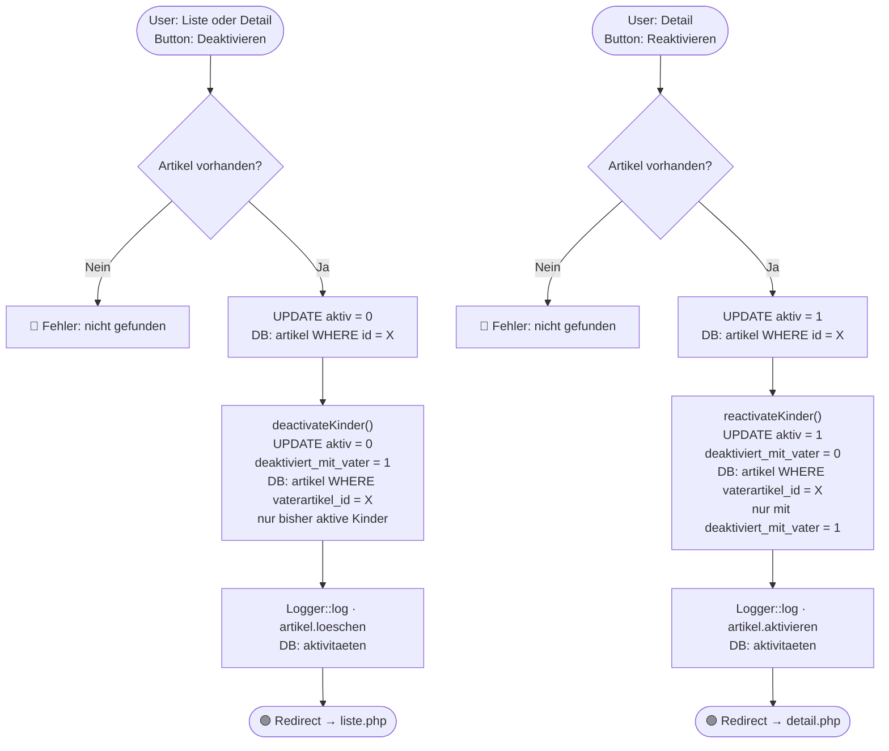

> **Wichtig:** `deactivateKinder()` setzt `deaktiviert_mit_vater = 1` — so weiß `reactivateKinder()` welche Kinder wieder aktiviert werden dürfen (nur die, die durch den Vater deaktiviert wurden, nicht manuell inaktive).

---

## 5. Varianten erstellen — Stufe 1: Achsen + Werte zuweisen

**Seiten:** `artikel/achsen_zuweisen.php` → `artikel/achsen_speichern.php`  
**Service:** `VariantenService::speichereAchsenUndWerte()`

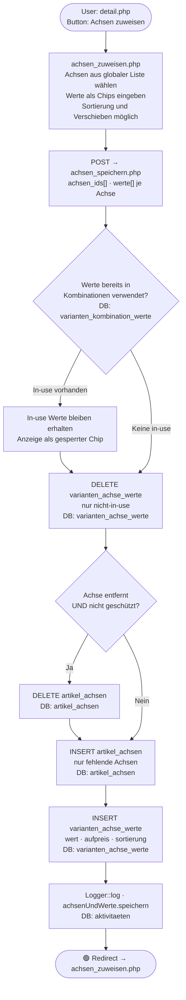

---

## 6. Varianten erstellen — Stufe 2: VarKombi-Generator

**Seiten:** `artikel/detail.php` Tab Varianten → `artikel/varkombi_erstellen.php`  
**Service:** `VariantenService::erstelleKombinationen()` + `ArtikelService::kopiereVaterRelationenZuKindern()`

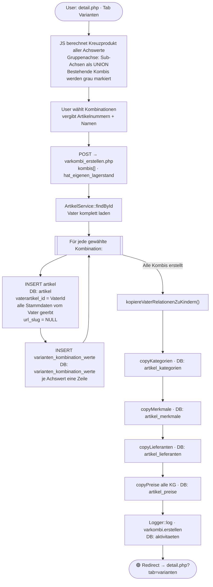

### Vererbung beim Erstellen

| Bereich | Felder |
|---------|--------|
| Stamm | `hersteller_id` · `steuerklasse_id` · `artikeltyp_id` · `einheit_id` |
| Beschreibungen | `kurzbeschreibung` · `beschreibung` · `technische_details` · `beschreibung_intern` |
| SEO | `meta_titel` · `meta_description` — `url_slug` = NULL |
| Logistik | `inhalt_menge` · `inhalt_einheit` · `gewicht_artikel` · `gewicht_versand` · `laenge` · `breite` · `hoehe` |
| Zoll | `herkunftsland` · `taric_code` |
| Grundpreis | `grundpreis_bezugsmenge` · `grundpreis_anzeigen` |
| Verhalten | `charge_pflicht` · `ueberverkauf_erlaubt` · `ist_auslaufartikel` |
| Relationen | Kategorien · Merkmale · Lieferanten · Preise alle KG |

---

## 7. Kind-Artikel bearbeiten

**Seiten:** `artikel/variante_bearbeiten.php` → `artikel/variante_aktualisieren.php`  
**Service:** `ArtikelService::kindUpdate()`

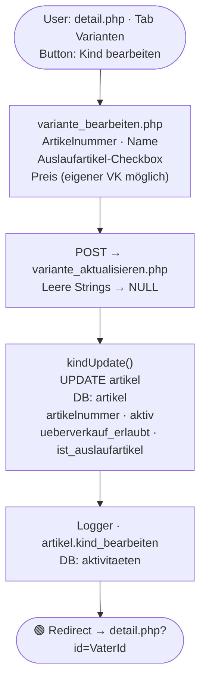

> **Hinweis:** Kind-Artikel können nur wenige Felder selbst ändern. Stammdaten (Beschreibungen, Gewicht, Kategorien usw.) kommen immer vom Vater und werden beim Vater-Update automatisch propagiert.

---

## 8. Kategorien zuweisen (Modal)

Die Kategorie-Zuweisung ist **Teil des Bearbeiten-Workflows** (siehe Workflow 2). Das Modal selbst läuft rein im Browser — kein separater Request bis "Übernehmen" geklickt wird.

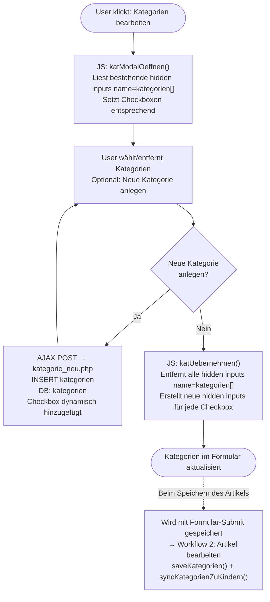

---

## 9. Kategorie-Baum verwalten

**Seite:** `artikel/kategorien_verwalten.php` (eigenständige Verwaltungsseite)  
**AJAX-Endpoints:** `kategorie_bearbeiten_ajax.php` · `kategorie_loeschen_ajax.php` · `kategorie_sort_ajax.php`

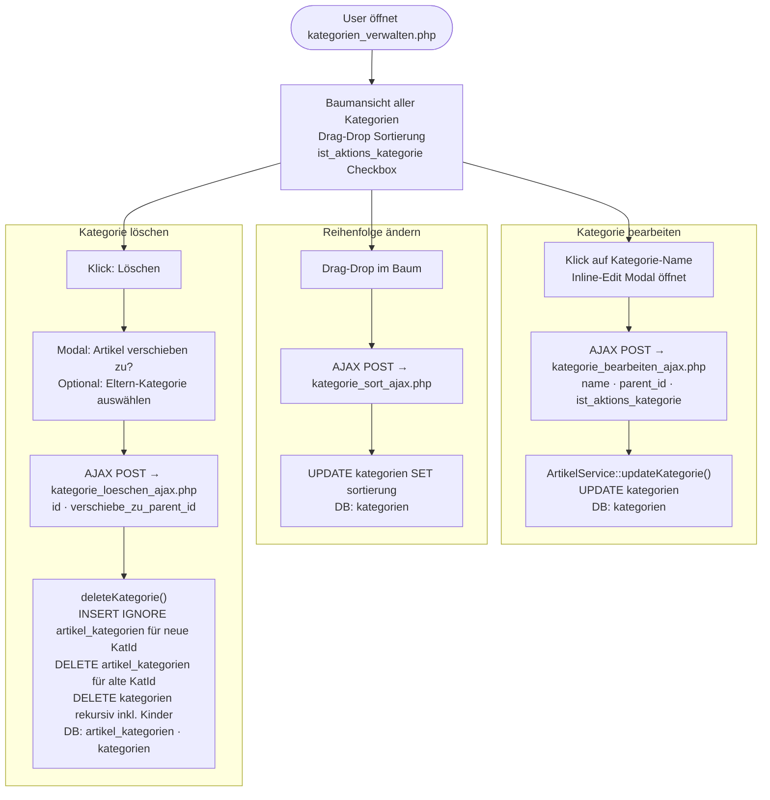

> **Wichtig bei Löschen:** Alle Kinder-Kategorien im Baum werden mitgelöscht. Artikel können optional zu einer anderen Kategorie verschoben werden — sonst werden ihre Kategorie-Zuweisungen gelöscht.

---

## 10. Preis-Workflows

### 10a. Standard-Kundengruppen-Preis setzen

**Endpoint:** `artikel/preis_speichern.php` (AJAX JSON)  
**Service:** `PreisService::speichereKundengruppenPreis()`

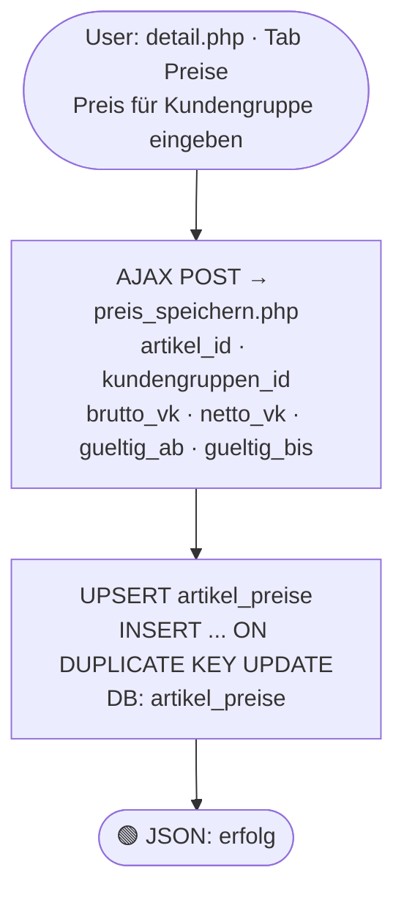

### 10b. Staffelpreis setzen

**Endpoint:** `artikel/staffelpreis_speichern.php` (AJAX JSON)  
**Service:** `PreisService::speichereStaffelpreis()`

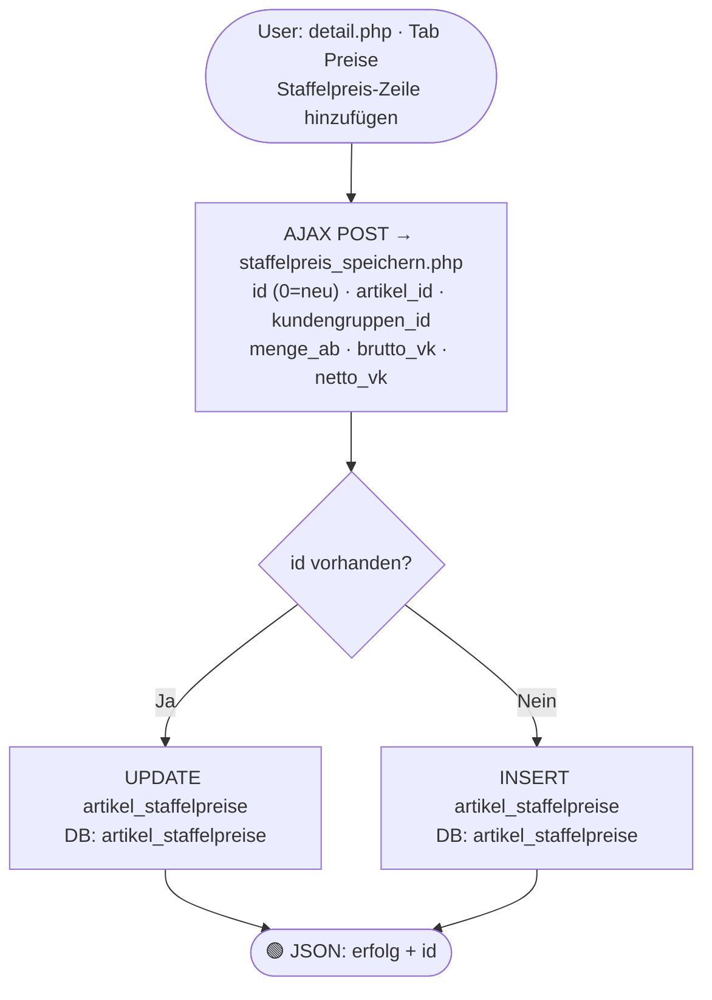

### 10c. UVP setzen

**Endpoint:** `artikel/uvp_speichern.php` (AJAX JSON) — direkt DB, kein Service

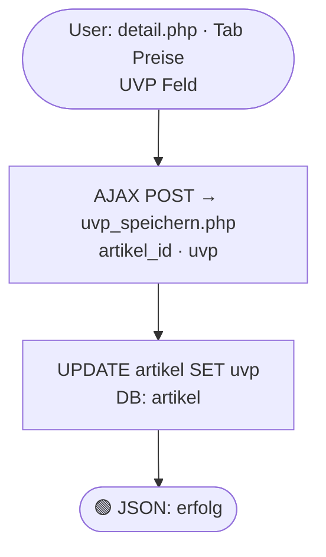

### 10d. SALE-Override (manueller Aktionspreis)

**Endpoint:** `artikel/sale_override_speichern.php` (AJAX JSON)  
**Service:** `PreisService::speichereSaleOverride()`  
**Priorität:** Höchste — überschreibt Aktionspreise und KG-Preise

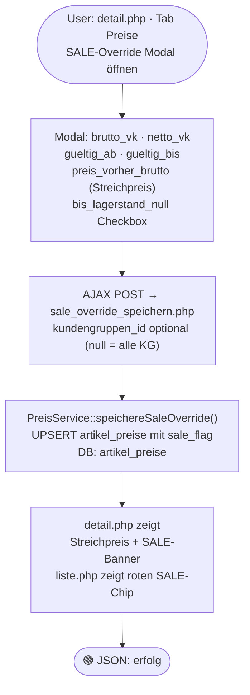

### Preis-Prioritätskette (PreisService::getEffektiverPreis)

```
1. SALE-Override (höchste Priorität, überschreibt alles)
2. Aktion (aktionen_artikel_preise — wenn laufende Aktion für Kategorie)
3. Kundengruppen-Preis (artikel_preise für spezifische KG)
4. Standard-Preis (artikel_preise für Standard-KG)
```

---

## 11. Status-Workflows

### 11a. Auslaufartikel setzen / entfernen

**Service:** `ArtikelService::auslaufSetzen()` / `auslaufEntfernen()`

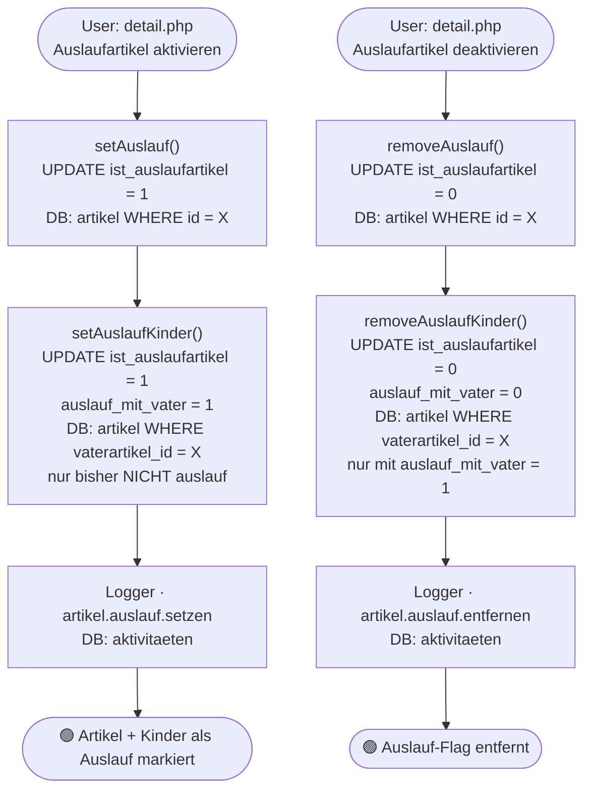

> **Wareneingang-Sonderfall:** Bei Wareneingang auf einen Auslaufartikel mit Bestand = 0 wird `ist_auslaufartikel` automatisch auf 0 gesetzt (Auto-Reaktivierung via `LagerService`).

### 11b. Aktiv / Inaktiv schalten

Siehe [Workflow 4: Artikel löschen und reaktivieren](#4-artikel-löschen-und-reaktivieren) — das ist dieselbe Funktion. "Löschen" ist hier ein Soft-Delete (aktiv = 0).

---

## 12. SEO-Daten speichern

**Endpoint:** `artikel/seo_speichern.php` (POST, kein Service — direkter DB-Zugriff)  
**Seite:** `artikel/detail.php` Tab SEO

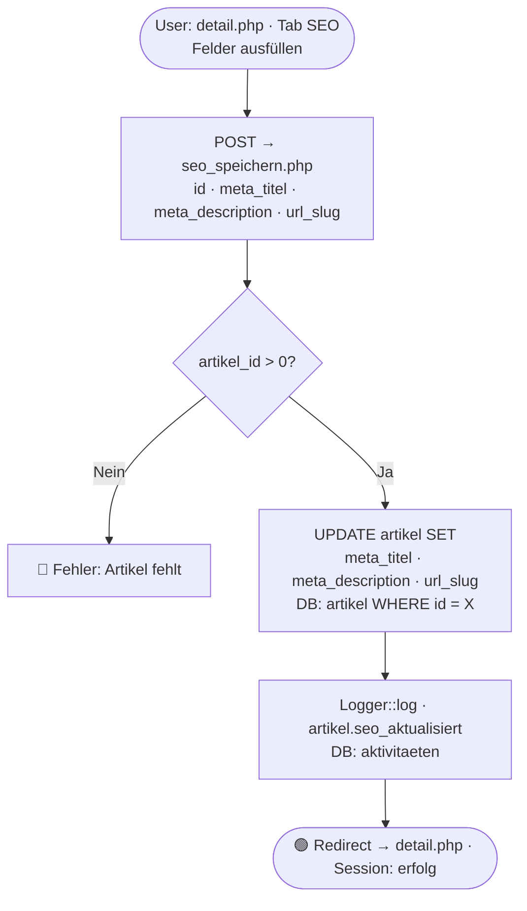

> **Hinweis:** `url_slug` muss systemweit eindeutig sein — wird für Shop-URLs verwendet. Kinder-Artikel haben eigene Slugs (oder NULL wenn noch nicht gesetzt).

## 13. Bilder-Workflow

**Dateien:** `bild_upload.php`, `bild_ajax.php`, `bild_loeschen.php`, `bilder.js`, `BilderRepository.php`  
**Seite:** `artikel/detail.php` Tab Bilder  
**Speicherort:** `public/uploads/artikel/{artikel_id}/` (Filesystem, PHP GD Resize)  
**DB:** `artikel_bilder` + `artikel_bilder_shops`

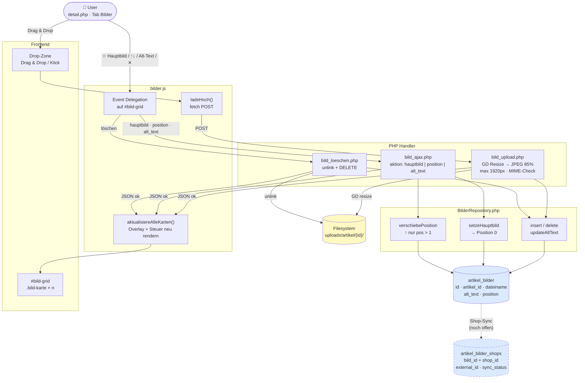

**Hauptbild-Logik:**
- Position 0 = Hauptbild — nur `setzeHauptbild()` / ☆-Button darf das ändern
- `verschiebePosition()`: ↑ erlaubt nur wenn `$pos > 1` (schützt Position 0)
- Im JS: nach jeder Aktion baut `aktualisiereAlleKarten()` alle Karten komplett neu → kein DOM-Stapeln

**Wasserzeichen (geplant):**
- ERP speichert immer das saubere Original
- Wasserzeichen wird beim Shop-Sync per GD on-the-fly aufgedrückt
- Konfigurierbar pro Shop im Admin-Menü (Bild + Position)
