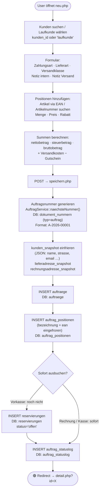
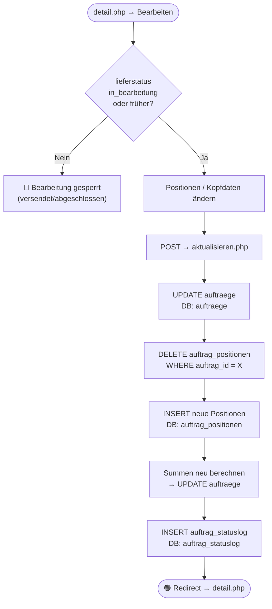
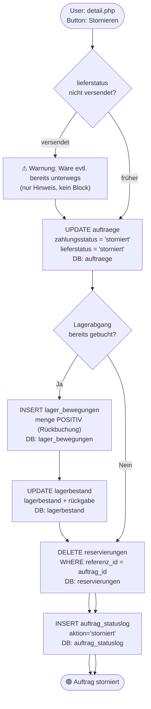
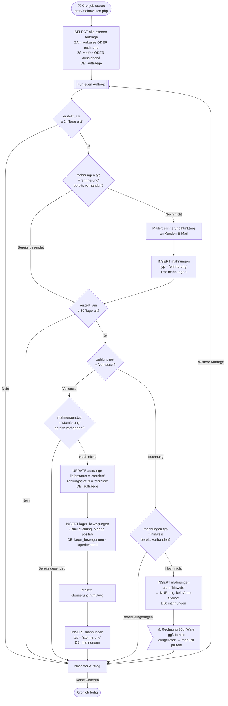
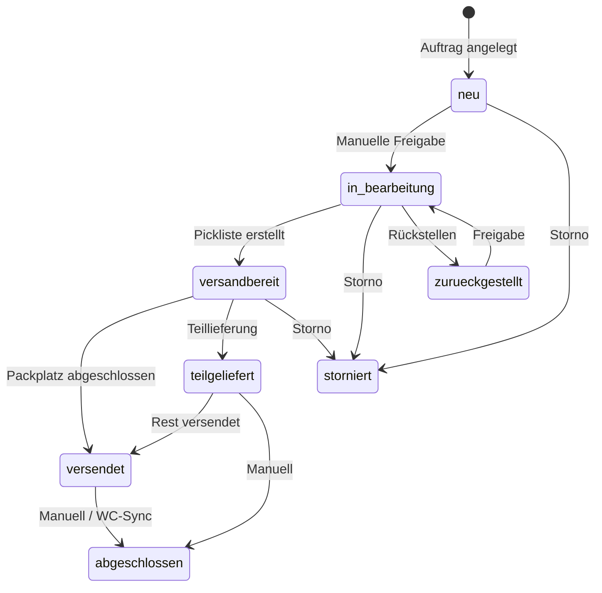

# Auftragsmodul: Workflows

> **Zielgruppe:** Entwickler + Fehlersuche nach Monaten  
> **Zweck:** Welche Tabellen, Services und Pfade sind bei welchem Auftragsproblem beteiligt?  
> **Handbuch:** siehe `../handbuch/auftraege_handbuch.md`

---

## Legende

| Symbol | Bedeutung |
|--------|-----------|
| Abgerundete Box | Start / Ende / Seite |
| Rechteck | Verarbeitungsschritt |
| Raute | Entscheidung |
| `DB:` | Betroffene DB-Tabelle(n) |
| 🔴 | Fehler-/Abbruchpfad |
| 🟢 | Erfolgspfad |

---

## Statusmodell (zuerst lesen!)

```
zahlungsstatus:  ausstehend → bezahlt | teilbezahlt | erstattet | storniert
lieferstatus:    neu → in_bearbeitung → versandbereit → versendet | teilgeliefert → abgeschlossen
                                                     ↘ storniert (jederzeit)
                                                     ↘ zurueckgestellt
```

**Schlüsseltabellen:**

| Tabelle | Inhalt |
|---------|--------|
| `auftraege` | Kopfdaten, Status-ENUMs, Snapshot-JSONs, Beträge |
| `auftrag_positionen` | Positionen (Artikel, Menge, Preise eingefroren) |
| `auftrag_statuslog` | Jede Statusänderung mit Diff-JSON |
| `auftrag_dokumente` | Pfade zu generierten PDFs |
| `rechnungen` | Rechnungsnummern (R-2026-xxxxx) |
| `mahnungen` | Erinnerungen/Stornierungen durch Cronjob |
| `lager_bewegungen` | Lagerabgänge (negativ) beim Verbuchen, Rückbuchung bei Storno |
| `reservierungen` | Reservierte Lagermengen für offene Aufträge |
| `picklisten` / `pickliste_auftraege` | Kommissionierung |

---

## 1. Auftrag manuell anlegen

**Seiten:** `auftraege/neu.php` → `auftraege/speichern.php` → `auftraege/detail.php`



### Debugging: Auftrag nicht angelegt
| Symptom | Wo suchen |
|---------|-----------|
| Doppelte Auftragsnummer | `dokument_nummern` — letzt_nr stuck? |
| Snapshot leer | `kunden_snapshot` NULL → kunden_id fehlte |
| Positionen fehlen | `auftrag_positionen` mit auftrag_id prüfen |

---

## 2. Auftrag bearbeiten (bis "in_bearbeitung")

**Seiten:** `auftraege/bearbeiten.php` → `auftraege/aktualisieren.php`

Positionen können geändert werden solange `lieferstatus IN ('neu','in_bearbeitung','versandbereit')`.



---

## 3. Zahlungseingang buchen

**Seite:** `auftraege/zahlung_buchen.php` (AJAX oder POST)

```mermaid
flowchart TD
    START(["User: detail.php\nButton: Zahlung buchen"])
    POST["POST: auftrag_id · betrag · zahlungsart"]
    CHK_BETRAG{"Betrag = bruttobetrag?"}
    VOLL["UPDATE auftraege\nzahlungsstatus = 'bezahlt'\nbezahlt_am = NOW()\nDB: auftraege"]
    TEIL["UPDATE auftraege\nzahlungsstatus = 'teilbezahlt'\nDB: auftraege"]
    RESERV_AUF["reservierungen → status='aufgeloest'\noder Lagerabgang direkt\nDB: reservierungen · lager_bewegungen"]
    LOG["INSERT auftrag_statuslog\nDB: auftrag_statuslog"]
    MAIL{"Auftragsbestätigung\nsenden?"}
    MAIL_SEND["Mailer::sendeTemplate\nauftragsbestaetigung.html.twig\nDB: aktivitaeten (log)"]
    END(["🟢 Banner: Zahlung gebucht"])

    START --> POST --> CHK_BETRAG
    CHK_BETRAG -->|"="|  VOLL --> RESERV_AUF --> LOG --> MAIL
    CHK_BETRAG -->|"<"| TEIL --> RESERV_AUF --> LOG --> MAIL
    MAIL -->|"Vorkasse + E-Mail"| MAIL_SEND --> END
    MAIL -->|"Sonstiges"| END
```

---

## 4. Stornierung (manuell)

**Seite:** `auftraege/stornieren.php`



---

## 5. Mahnwesen-Cronjob

**Datei:** `erp/cron/mahnwesen.php`  
**Zeitplan:** täglich, z.B. 08:00 Uhr  
**Ziel:** `zahlungsart IN ('vorkasse','rechnung') AND zahlungsstatus IN ('offen','ausstehend')`



### Debugging: Mahnwesen-Probleme
| Symptom | Wo suchen |
|---------|-----------|
| Erinnerung kam nicht | `mahnungen` WHERE auftrag_id = X · `aktivitaeten` Log · mail_aktiv='1'? |
| Falscher Storno | `mahnungen.typ` = 'stornierung' vorhanden? — evtl. doppelter Cronjob-Lauf |
| Rechnung fälschlich storniert | `zahlungsart` in auftraege prüfen — sollte 'rechnung' sein → nur 'hinweis' |

---

## 6. Statusübergänge — Übersicht


