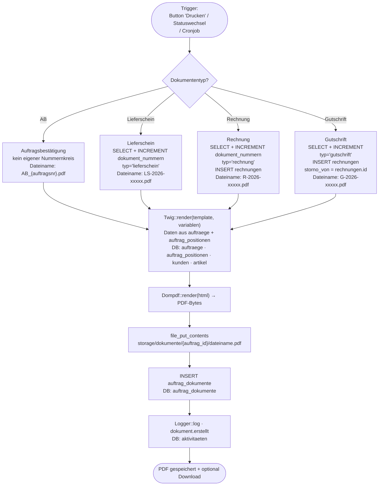
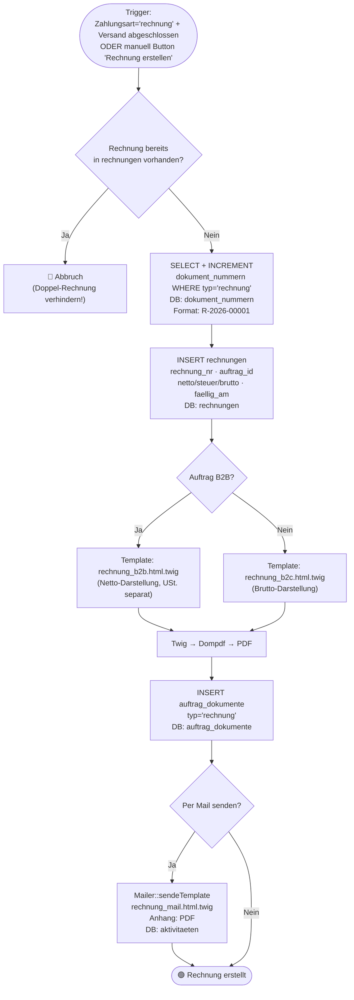
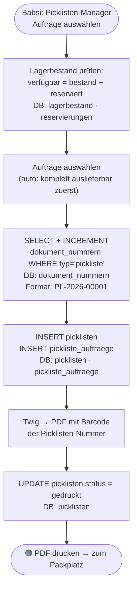

# Dokumente-System: Workflows

> **Zielgruppe:** Entwickler + Fehlersuche nach Monaten  
> **Zweck:** Welches Dokument wird wann erzeugt, welche Tabellen sind betroffen?

---

## Dokumententypen-Übersicht

| Typ | Nummer | Wann erzeugt | Tabelle |
|-----|--------|-------------|---------|
| Auftragsbestätigung (AB) | — (keine eigene Nr.) | Nach Auftragsanlage | `auftrag_dokumente` |
| Lieferschein | LS-2026-xxxxx | Versandbereit | `auftrag_dokumente` |
| Rechnung | R-2026-xxxxx | Zahlungseingang (Rechnung) / manuell | `rechnungen` + `auftrag_dokumente` |
| Gutschrift | G-2026-xxxxx | Storno einer Rechnung | `rechnungen` (storno_von) |
| Mahnung | — | Cronjob / manuell | `auftrag_dokumente` |
| Abholzettel | — | Auf Wunsch | `auftrag_dokumente` |
| Bon (Kasse) | B-2026-xxxxx | Kassenabschluss | Kassen-Modul (TODO) |
| Pickliste | PL-2026-xxxxx | Babsi erstellt | `picklisten` |

**Nummernkreise** alle in `dokument_nummern` (typ, praefix, jahr, letzt_nr).

---

## 1. Dokument erzeugen — allgemeiner Flow

**Service:** `DokumentService` (geplant) / `TwigRenderer` + Dompdf



---

## 2. Rechnung — Detailflow



---

## 3. Gutschrift (Rechnungsstorno)

```mermaid
flowchart TD
    START(["User: Rechnung stornieren\nButton in detail.php")
    CHK_RE{"Rechnung vorhanden\nund nicht bereits storniert?"}
    ERR["🔴 Fehler"]
    NR["SELECT + INCREMENT\ndokument_nummern WHERE typ='gutschrift'\nDB: dokument_nummern\nFormat: G-2026-00001"]
    INS_GS["INSERT rechnungen\nstorno_von = rechnung.id\nstorniert = 1 auf Original\nDB: rechnungen (2 Zeilen)"]
    TWIG["Template: gutschrift.html.twig\n(Negativbeträge)"]
    PDF["Dompdf → PDF"]
    INS_DOK["INSERT auftrag_dokumente\ntyp='gutschrift'\nDB: auftrag_dokumente"]
    LAGER{"Ware zurückgekommen?"}
    RUECK["LagerService::rueckbuchungBuchen()\nDB: lager_bewegungen · lagerbestand"]
    MAIL["Mailer: gutschrift_mail.html.twig\nmit Anhang"]
    END(["🟢 Gutschrift erstellt"])

    START --> CHK_RE
    CHK_RE -->|Nein| ERR
    CHK_RE -->|Ja| NR --> INS_GS --> TWIG --> PDF --> INS_DOK --> LAGER
    LAGER -->|Ja (Retoure)| RUECK --> MAIL
    LAGER -->|Nein| MAIL --> END
    RUECK --> END
```

---

## 4. Pickliste erzeugen (Babsi-Seite, TODO)



---

## 5. Debugging — Dokumente

| Problem | Wo suchen |
|---------|-----------|
| PDF nicht gefunden | `auftrag_dokumente.dateiname` → Pfad auf Disk vorhanden? |
| Doppelte Rechnung | `rechnungen WHERE auftrag_id = X` — `CHK_RRE` hat nicht gegriffen |
| Falsche Rechnungsnummer | `dokument_nummern WHERE typ='rechnung'` — letzt_nr prüfen |
| Gutschrift referenziert falsche Rechnung | `rechnungen.storno_von` prüfen |
| Pickliste bleibt "offen" | Status in `picklisten` — alle zugehörigen `auftraege.lieferstatus` prüfen |
