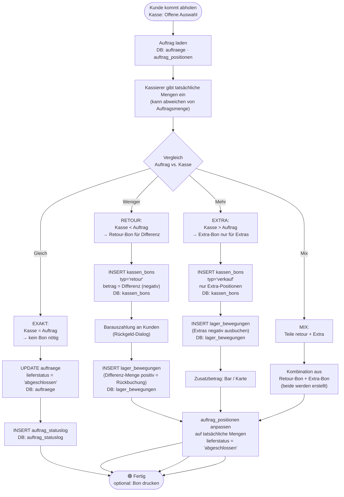
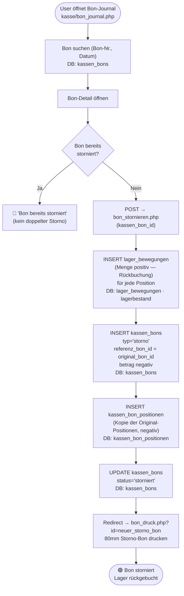
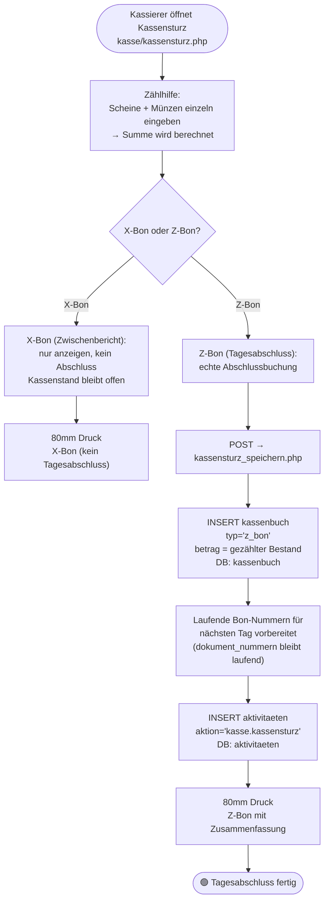
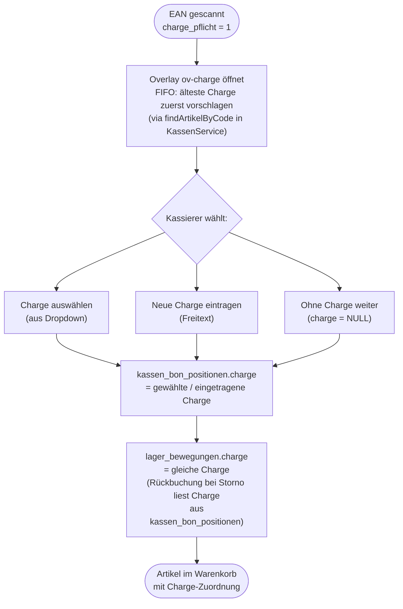
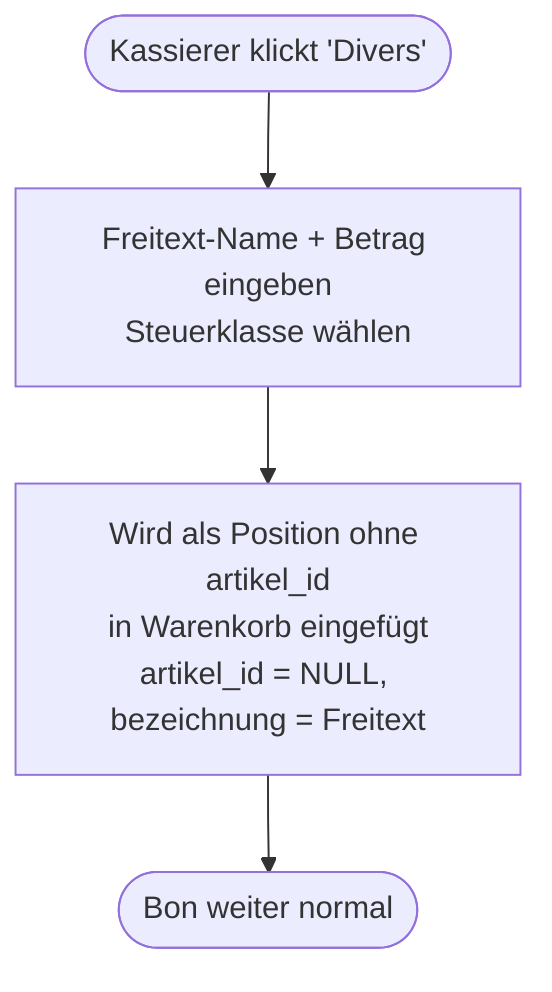

# Kasse (POS): Workflows

> **Zielgruppe:** Entwickler + Fehlersuche nach Monaten  
> **Zweck:** Bon-Erstellung, Zahlwege, Abholbereit-Flow, Kassensturz — was passiert wo?

---

## Systemübersicht

```
Kasse (kasse/index.php)
─────────────────────────────────────────────────────────────
EAN-Scan / Namenssuche → Artikel in Warenkorb
Zahlart: Bar | Karte extern | Gutschein
Chargen-Dialog bei charge_pflicht=1
Vater→Variante-Auswahl bei ist_vater=1
                         ↓
              bon_speichern.php
                         ↓
kassen_bons + kassen_bon_positionen  ←→  lager_bewegungen
                         ↓
              bon_druck.php (80mm Browser-Druck)
                         ↓
              [GEPLANT] RKSV / BFR-BONit Signatur
```

**Schlüsseltabellen:**

| Tabelle | Inhalt |
|---------|--------|
| `kassen` | Kassen-Instanzen (Name, Lager, RKSV-ID) |
| `kassen_bons` | Bon-Kopfdaten (Gesamtbetrag, Zahlart, Typ: verkauf/retour/storno) |
| `kassen_bon_positionen` | Positionen pro Bon (Artikel, Menge, Preis, Charge) |
| `kassenbuch` | Kassenstand-Einträge (Einlage, Entnahme, Z-Bon) |
| `offene_auswahl` | Abholbereit+bezahlt Aufträge (Link ERP-Auftrag ↔ Kasse) |
| `lager_bewegungen` | Lagerabgänge (negativ) bei jedem Bon |

---

## 1. Bon erstellen — Normalverkauf

**Seiten:** `kasse/index.php` → `kasse/bon_speichern.php` → `kasse/bon_druck.php`  
**JS:** Inline-Script in index.php (ausgelagert: kasse_bon.js)

```mermaid
flowchart TD
    START(["User öffnet kasse/index.php"])
    SCAN["EAN scannen\noder Namenssuche-Modal öffnen"]

    CHK_ART{"Artikel gefunden?"}
    NOT_FOUND["🔴 Fehlermeldung:\n'Artikel nicht gefunden'"]

    CHK_VATER{"ist_vater = 1?"}
    VAR_MODAL["Varianten-Modal öffnen\nKind-Artikel wählen"]

    CHK_CHARGE{"charge_pflicht = 1?"}
    CHARGE_MODAL["Chargen-Dialog (ov-charge)\nCharge wählen / nachzutragen / ohne"]

    WARENKORB["Artikel zum Warenkorb hinzufügen\nMenge · Preis · Rabatt %"]
    REPEAT{"Weitere Artikel?"}

    ZAHLUNG["Zahlart wählen:\nBar | Karte extern | Gutschein"]
    CHK_BAR{"Bar?"}
    RUECKGELD["Gegeben-Betrag eingeben\nRückgeld = Gegeben − Gesamt"]

    POST["POST → bon_speichern.php\n(kasse_id, positionen[], zahlart, betrag)"]

    LAGER["INSERT lager_bewegungen\n(menge negativ, je Position)\nUPDATE lagerbestand\nDB: lager_bewegungen · lagerbestand"]

    BON_NR["Bon-Nummer generieren\nDB: dokument_nummern (typ='bon')"]
    INS_BON["INSERT kassen_bons\n(typ='verkauf', zahlart, bruttobetrag)\nDB: kassen_bons"]
    INS_POS["INSERT kassen_bon_positionen\n(artikel_id, bezeichnung, charge)\nDB: kassen_bon_positionen"]
    LOG["INSERT aktivitaeten\naktion='kasse.bon_erstellt'\nDB: aktivitaeten"]

    DRUCK["Redirect → bon_druck.php?id=X\n80mm Browser-Druck\n@page { size: 80mm auto }"]
    END(["🟢 Bon fertig — weiter zum nächsten"])

    START --> SCAN --> CHK_ART
    CHK_ART -->|"Nicht gefunden"| NOT_FOUND --> SCAN
    CHK_ART -->|"Gefunden"| CHK_VATER
    CHK_VATER -->|"Ja"| VAR_MODAL --> CHK_CHARGE
    CHK_VATER -->|"Nein"| CHK_CHARGE
    CHK_CHARGE -->|"Ja"| CHARGE_MODAL --> WARENKORB
    CHK_CHARGE -->|"Nein"| WARENKORB
    WARENKORB --> REPEAT
    REPEAT -->|"Ja"| SCAN
    REPEAT -->|"Nein"| ZAHLUNG
    ZAHLUNG --> CHK_BAR
    CHK_BAR -->|"Ja"| RUECKGELD --> POST
    CHK_BAR -->|"Karte/Gutschein"| POST
    POST --> LAGER --> BON_NR --> INS_BON --> INS_POS --> LOG --> DRUCK --> END
```



### Debugging: Bon nicht erstellt
| Symptom | Wo suchen |
|---------|-----------|
| Artikel nicht gefunden | `artikel_codes` WHERE code = EAN · aktiv=1? |
| Charge fehlt in Bon | `kassen_bon_positionen.charge` NULL → Chargen-Dialog übersprungen? |
| Lagerbestand nicht abgebucht | `lager_bewegungen` WHERE referenz_tabelle='kassen_bons' AND referenz_id=X |
| Bon-Nummer doppelt | `dokument_nummern` WHERE typ='bon' — letzt_nr stuck? |

---

## 2. Abholbereit+bezahlt — 4 Fälle

**Seiten:** `kasse/offene_auswahl.php` → `kasse/offene_auswahl_speichern.php` → `kasse/offene_auswahl_verarbeiten.php`

Wenn ein ERP-Auftrag auf "abholbereit" gesetzt wurde UND bezahlt ist, erscheint er in der Kasse.  
Die Kasse vergleicht die Auftrags-Positionen mit dem was der Kunde tatsächlich mitnimmt.



### Wichtiger Hinweis: kunden_snapshot
```
Bei K1 (Kasse 1) Bons wird kunden_snapshot IMMER vom Original-Auftrag kopiert.
Nicht neu aus kunden-Tabelle laden — Daten könnten inzwischen geändert sein.
→ kassen_bons.kunden_snapshot = auftraege.kunden_snapshot (eingefroren)
```

---

## 3. Bon stornieren

**Seiten:** `kasse/bon_journal.php` → `kasse/bon_stornieren.php`



---

## 4. Kassensturz / Z-Bon (Tagesabschluss)

**Seiten:** `kasse/kassensturz.php` → `kasse/kassensturz_speichern.php`



---

## 5. Chargen-Dialog

Bei Artikeln mit `charge_pflicht=1` erscheint beim Scan ein Overlay.



---

## 6. Divers-Artikel (freier Preis)

Für Artikel ohne Stammdatensatz (z.B. Sonderpositionen, Spenden):



---

## Debugging-Checkliste Kasse

```
Bon nicht gedruckt?
  → bon_druck.php?id=X direkt aufrufen
  → 80mm Thermodrucker als Windows-Standarddrucker gesetzt?
  → @page { size: 80mm auto } im Druck-CSS vorhanden?

Lagerbestand nach Bon falsch?
  → lager_bewegungen WHERE referenz_tabelle='kassen_bons' AND referenz_id=X
  → kassen_bon_positionen: Menge stimmt?

Abholbereit-Auftrag erscheint nicht in Kasse?
  → auftraege: lieferstatus='abholbereit'? zahlungsstatus='bezahlt'?
  → offene_auswahl WHERE auftrag_id=X vorhanden?

Chargen-Problem?
  → kassen_bon_positionen.charge prüfen
  → lager_bewegungen.charge muss mit bon_position.charge übereinstimmen
  → Storno-Rückbuchung liest Charge aus original bon_positionen
```
