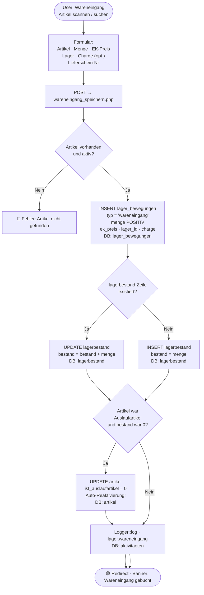
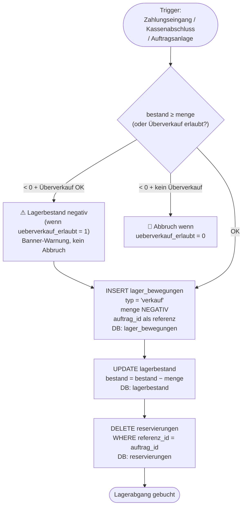
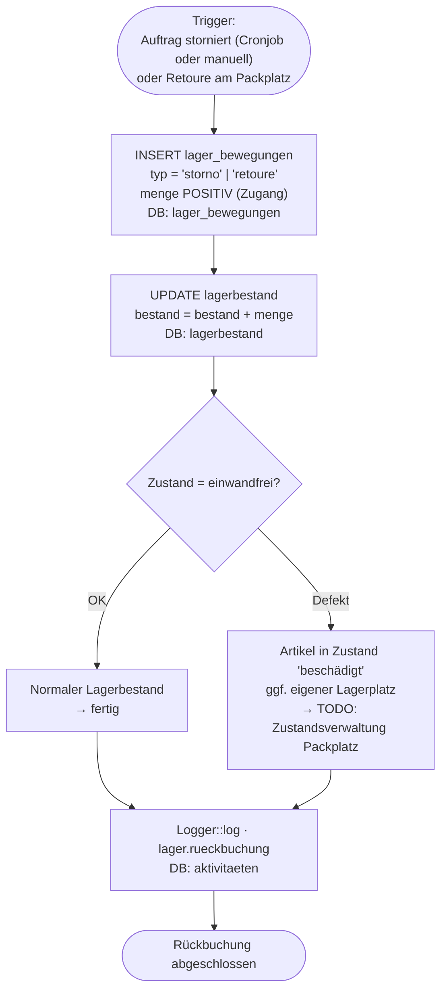
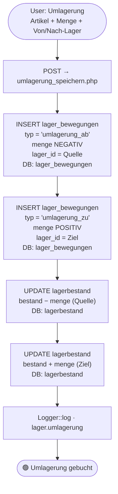
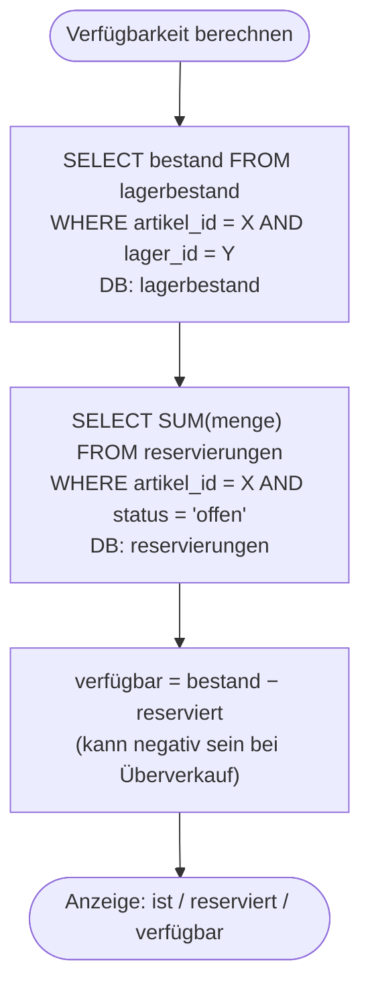

# Lager-Modul: Workflows

> **Zielgruppe:** Entwickler + Fehlersuche nach Monaten  
> **Zweck:** Wie wird Lagerbestand berechnet? Wo passiert was bei Zu- und Abgängen?

---

## Datenmodell (zuerst lesen!)

```
lagerbestand (pro Artikel × Lager × Charge)
    ↑ wird IMMER über LagerService aktualisiert
    ↑ Quelle der Wahrheit: lagerbestand.bestand
    ↑ Audit-Trail: lager_bewegungen (nie löschen!)

reservierungen
    ↑ "weich" reservierte Mengen für offene Aufträge
    ↑ verfügbar = lagerbestand.bestand − SUM(reservierungen.menge WHERE status='offen')
```

**Schlüsseltabellen:**

| Tabelle | Inhalt |
|---------|--------|
| `lagerbestand` | Aktueller Bestand (artikel_id × lager_id × charge) |
| `lager_bewegungen` | Jede Bewegung mit Menge, Typ, Benutzer, EK-Preis |
| `lager` | Lager-Definitionen (Standard, Messe, extern_haendler …) |
| `reservierungen` | Weiche Reservierungen für offene Aufträge |
| `artikel` | Hat kein eigenes lagerbestand-Feld — alles über lagerbestand-Tabelle |

**Lager-IDs (Konfiguration):**
- ID 1 = Standardlager (immer normal)
- ID 2 = Lager Messe (umschaltbar normal ↔ Messe)
- typ = 'extern_haendler' = Konsignationslager bei Partnern

---

## 1. Wareneingang (freier Zugang)

**Seiten:** `lager/wareneingang.php` → `lager/wareneingang_speichern.php`  
**Service:** `LagerService::wareneingangBuchen()`



---

## 2. Lagerabgang (Verkauf / Auftrag)

**Service:** `LagerService::lagerabgangBuchen()`  
Wird aufgerufen beim: Zahlungseingang (Vorkasse), Kassenabschluss (Bar), Auftragsanlage (Rechnung)



---

## 3. Lagerrückbuchung (Storno / Retoure)

**Service:** `LagerService::rueckbuchungBuchen()`



---

## 4. Umlagerung (Standardlager ↔ Messe)

**Seite:** `lager/umlagerung.php` (geplant)  
**Service:** `LagerService::umlagerungBuchen()`



---

## 5. Reservierungen (Verfügbarkeitsberechnung)



**Reservierung-Lifecycle:**

| Ereignis | Aktion |
|---------|--------|
| Auftrag angelegt (Vorkasse) | INSERT reservierungen status='offen' |
| Zahlung eingegangen | DELETE reservierungen → Lagerabgang buchen |
| Auftrag storniert | DELETE reservierungen |
| Lagerabgang ohne Reservierung | Direkt buchen (Kasse, Sofort-Zahlung) |

---

## 6. Bestandsermittlung — Debugging-Kurzformel

```sql
-- Bestand eines Artikels im Standardlager (lager_id=1)
SELECT bestand FROM lagerbestand WHERE artikel_id = ? AND lager_id = 1;

-- Alle Bewegungen eines Artikels (chronologisch)
SELECT typ, menge, erstellt_am, benutzer_id
FROM lager_bewegungen
WHERE artikel_id = ?
ORDER BY erstellt_am;

-- Offene Reservierungen
SELECT SUM(menge) FROM reservierungen
WHERE artikel_id = ? AND status = 'offen';

-- Erwarteter Bestand (aus Bewegungen neu berechnen = Kontrolle)
SELECT SUM(menge) FROM lager_bewegungen WHERE artikel_id = ? AND lager_id = 1;
```

> **Wenn `lagerbestand.bestand` ≠ `SUM(lager_bewegungen.menge)` → Datenfehler!**  
> Ursache: direkte DB-Updates außerhalb LagerService, oder abgebrochene Transaktionen.
