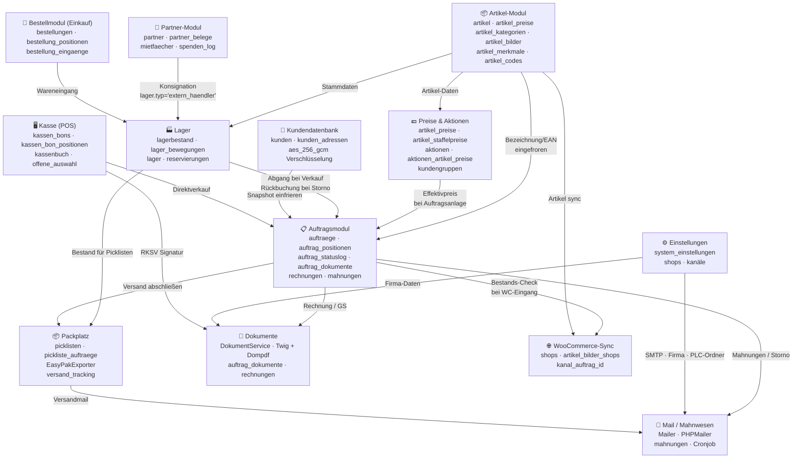

# MeaLana ERP — Modul-Übersicht & Abhängigkeiten

> **Zielgruppe:** Entwickler + Fehlersuche nach Monaten  
> **Zweck:** Orientierungskarte — welches Modul hängt woran?

---

## Modul-Karte



---

## Fertige Module (Stand 2026-07-01)

| Modul | Seiten | Status |
|-------|--------|--------|
| **Artikel** | liste / detail / neu / bearbeiten / kopieren | ✅ Fertig |
| **Artikel-Bilder** | detail Tab Bilder, GD-Resize | ✅ Fertig |
| **Artikel-Merkmale** | merkmale/ (2-Ebenen, Single/Multi) | ✅ Fertig |
| **Varianten** | Achsen / Werte / VarKombi-Generator | ✅ Fertig |
| **Kategorien** | Baum / Drag-Drop / Aktionskategorien | ✅ Fertig |
| **Preise** | KG-Preise / Staffel / UVP / SALE-Override | ✅ Fertig |
| **Aktionen** | Aktionszeiträume / Artikel-Preise / Cronjob | ✅ Fertig |
| **Lager** | Wareneingang / Übersicht / Bewegungen | ✅ Fertig |
| **Auftragsmodul** | Liste / Detail / Neu / Bearbeiten / Statuslog | ✅ Fertig |
| **Mahnwesen** | Cronjob (14d Erinnerung / 30d Vorkasse Storno) | ✅ Fertig |
| **Packplatz Warenausgang** | Scan / EasyPak / Versandmail | ✅ Fertig |
| **Einstellungen** | Firma / Kanäle / SMTP / System | ✅ Fertig |
| **Kundendatenbank** | Liste / Detail / AES-256 | ✅ Fertig |
| **Partner-Modul** | Mietfächer / Kommission / Spenden | ✅ Fertig |
| **Bestellmodul (Einkauf)** | Bestellungen / Positionen / Eingang | ✅ Fertig |
| **Kasse (POS) Phase 1+2** | EAN-Scan, Bon-Erstellung, Kassensturz, Abholbereit-Flow, Chargen-Dialog | ✅ Fertig |

## Offene Module (Reihenfolge laut Plan)

| Modul | Priorität | Abhängigkeiten |
|-------|-----------|----------------|
| Picklisten-Manager (Babsi) | 🔴 Nächste Phase | Lagerstand ist/reserviert/verfügbar |
| Packplatz: Intern / Retoure | 🔴 Nächste Phase | Packplatz-Warenausgang fertig |
| Kasse Phase 3: RKSV | 🟡 Nach Phase 1+2 | BFR-BONit API (Referenz: reference_bfr_api.md) |
| Kasse Phase 3: Bon-Park | 🟡 Nach Phase 1+2 | Kasse Phase 1 fertig |
| WooCommerce-Sync | 🟡 Parallel | artikel_bilder_shops, shops-Tabelle |
| Druck-Listen | 🟢 Mit Druck-Modul | EAN/Bilder-Qualitätslisten |
| Statistik / Dashboard | 🟢 Nach Verkauf | Auftragsmodul + Lager |

---

## Schlüssel-Services

| Klasse | Datei | Zuständigkeit |
|--------|-------|---------------|
| `Database` | `src/core/Database.php` | PDO-Singleton |
| `Logger` | `src/core/Logger.php` | Aktivitäten-Log |
| `Mailer` | `src/core/Mailer.php` | PHPMailer-Wrapper, mail_aktiv-Flag |
| `EasyPakExporter` | `src/core/EasyPakExporter.php` | EasyPak-XML für PLC |
| `ArtikelService` | `src/services/ArtikelService.php` | CRUD + Propagierung |
| `VariantenService` | `src/services/VariantenService.php` | Achsen + VarKombi |
| `LagerService` | `src/services/LagerService.php` | Alle Lagerbewegungen |
| `PreisService` | `src/services/PreisService.php` | Effektivpreis-Berechnung |
| `DokumentService` | `src/services/DokumentService.php` | Twig + Dompdf |
| `KassenService` | `src/services/KassenService.php` | erstelleBon, storniereBon, X-Bon/Z-Bon, FIFO-Charge |
| `EasyPakExporter` | `src/core/EasyPakExporter.php` | EasyPak-XML für PLC (Österr. Post) |

---

## Workflow-Dokumente

| Datei | Inhalt |
|-------|--------|
| [artikel_workflows.md](artikel_workflows.md) | Artikel-CRUD, Varianten, Propagierung |
| [auftraege_workflows.md](auftraege_workflows.md) | Auftrag anlegen, Zahlung, Storno, Mahnwesen |
| [lager_workflows.md](lager_workflows.md) | Wareneingang, Bewegungsprotokoll |
| [packplatz_workflows.md](packplatz_workflows.md) | Scan-Interface, EasyPak, Picklisten |
| [dokumente_workflows.md](dokumente_workflows.md) | PDF-Erzeugung, Rechnung, Gutschrift |
| [kasse_workflows.md](kasse_workflows.md) | Bon-Erstellung, Abholbereit-Flow, Kassensturz, Chargen-Dialog |

---

## Kritische Abhängigkeiten — Debugging-Checkliste

```
Bestand stimmt nicht?
  → lagerbestand.bestand vs SUM(lager_bewegungen.menge) vergleichen
  → reservierungen WHERE status='offen' addieren

Preis falsch?
  → PreisService::getEffektiverPreis Prioritätskette:
    SALE-Override > Aktion > KG-Preis > Standard-Preis
  → aktionen: gueltig_ab/bis prüfen, gestartet=1?

Auftrag hat falschen Status?
  → auftrag_statuslog: Verlauf ansehen
  → mahnungen: War Cronjob-Storno?

Dokument fehlt?
  → auftrag_dokumente WHERE auftrag_id = X
  → Datei auf Disk: storage/dokumente/{auftrag_id}/

Mail kam nicht?
  → system_einstellungen: mail_aktiv = '1'?
  → aktivitaeten: Eintrag vorhanden aber kein Versand?
  → SMTP-Einstellungen: Einstellungen → Mail/SMTP → Test-Mail senden
```
