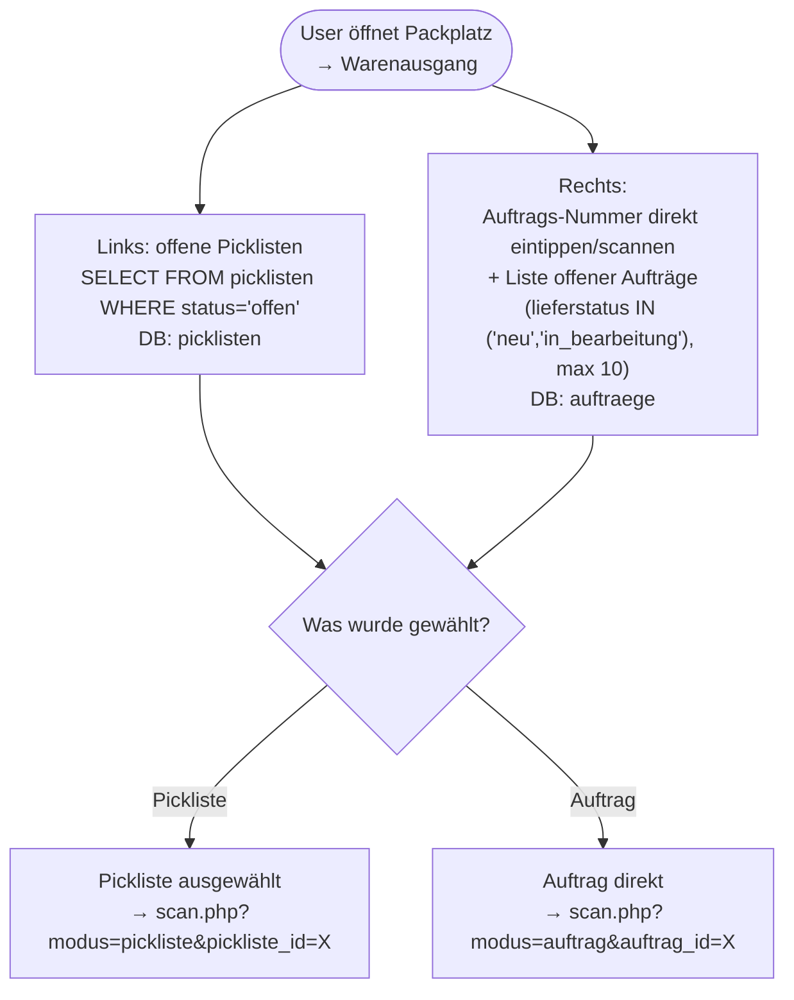
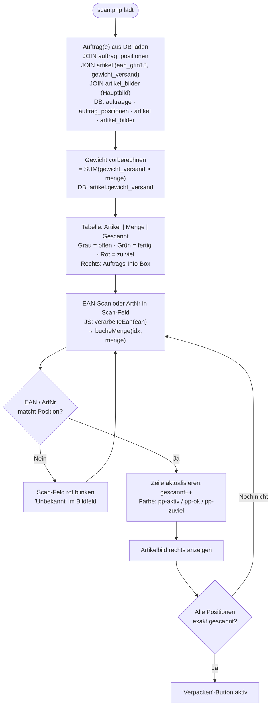
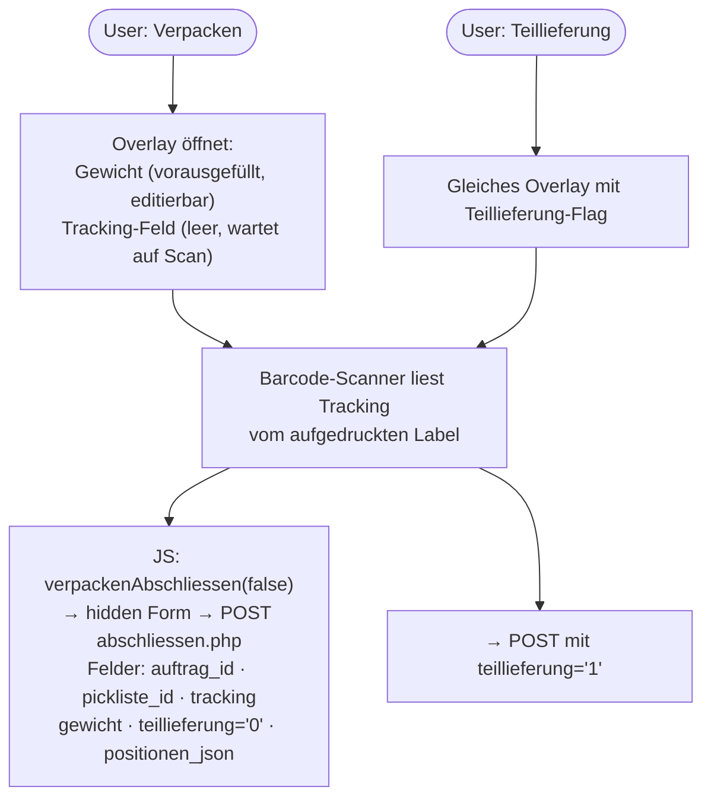
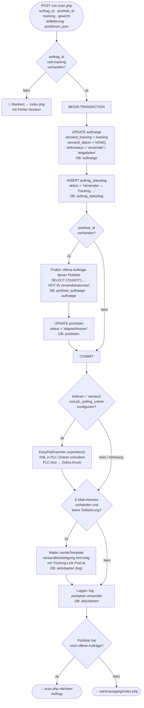
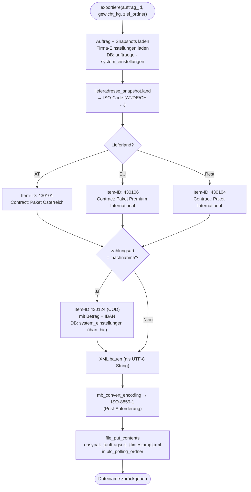

# Packplatz-Modul: Workflows

> **Zielgruppe:** Entwickler + Fehlersuche nach Monaten  
> **Zweck:** Scan-Flow, EasyPak, Picklisten — was passiert wo?

---

## Systemübersicht

```
Babsi (Büro-PC)          Packplatz-PC (Tablet/Touchscreen)    PLC (Österr. Post)
─────────────────        ────────────────────────────────     ─────────────────
Picklisten-Manager  →    packplatz/warenausgang/              EasyPak XML lesen
(Aufträge auswählen,     scan.php (EAN-Scan, Grün/Rot)        → Zebra-Druck
 PDF drucken)            abschliessen.php (Status, Mail)      → Label mit Tracking
                         ↓                                    ← Tracking-Nr am Label
                         Tracking-Nr vom Label abscannen
```

**Schlüsseltabellen:**

| Tabelle | Inhalt |
|---------|--------|
| `auftraege` | lieferstatus, versand_tracking, versand_datum |
| `auftrag_positionen` | Positionen inkl. EAN (eingefroren) |
| `picklisten` | Picklisten-Kopfdaten (offen / gedruckt / abgeschlossen) |
| `pickliste_auftraege` | Zuordnung Pickliste ↔ Aufträge (n:m) |
| `auftrag_statuslog` | Statuslog-Einträge (aktion = "Versendet — Tracking: XXX") |

---

## 1. Warenausgang — Übersichtsseite

**Seite:** `packplatz/warenausgang/index.php`



---

## 2. Scan-Interface

**Seite:** `packplatz/warenausgang/scan.php`  
**JS:** `public/js/packplatz_scan.js`



### Overlay-Flow nach "Verpacken"



---

## 3. Abschluss-Handler

**Seite:** `packplatz/warenausgang/abschliessen.php`



---

## 4. EasyPak-Exporter

**Klasse:** `src/core/EasyPakExporter.php`  
**Dateiformat:** ISO-8859-1 XML im PLC-Polling-Ordner



---

## 5. Debugging-Hinweise

| Problem | Wo suchen |
|---------|-----------|
| Tracking fehlt in auftraege | `abschliessen.php` wurde nicht erreicht (JS-Fehler? POST leer?) |
| EasyPak XML nicht erstellt | `plc_polling_ordner` in system_einstellungen leer/falscher Pfad? `is_dir()` prüfen |
| Versandmail nicht angekommen | `aktivitaeten`-Log: mail_aktiv='1'? email in kunden_snapshot? |
| Pickliste bleibt "offen" | Prüfen: alle pickliste_auftraege.auftrag_id → lieferstatus IN (versendet/storniert)? |
| Falsche Gewichtsangabe | artikel.gewicht_versand für alle Positionen prüfen (nicht gewicht_artikel!) |
| Scan erkennt EAN nicht | `auftrag_positionen.ean` leer — EAN wurde beim Anlegen nicht eingefroren |
